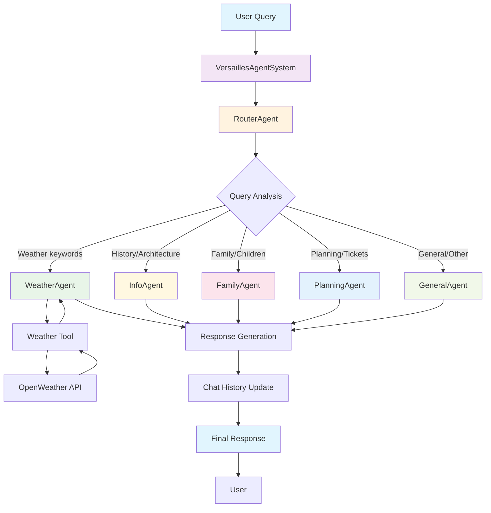
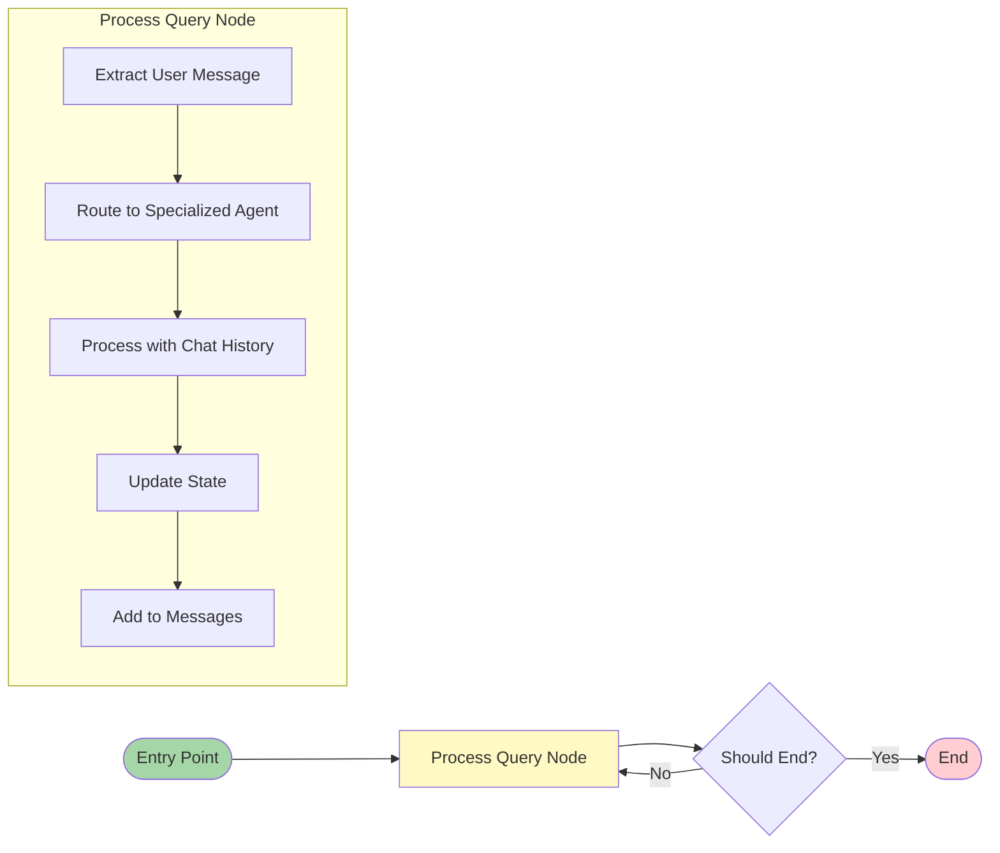

# Versailles Multi-Agent System

## Architecture Overview

This system implements a sophisticated multi-agent architecture using LangGraph for intelligent conversation routing and specialized responses about the Palace of Versailles.

## Execution Flow Graph



## Agent Specializations

### 🌤️ WeatherAgent
- **Purpose**: Weather forecasts and visit planning based on conditions
- **Tools**: OpenWeather API integration
- **Prompt**: `agents/prompts/weather_agent_prompt.md`
- **Keywords**: weather, forecast, temperature, visit, plan

### 🏰 InfoAgent
- **Purpose**: Historical information, architecture, collections
- **Specialties**: Louis XIV, Galerie des Glaces, royal apartments
- **Prompt**: `agents/prompts/info_agent_prompt.md`
- **Keywords**: history, architecture, king, palace, art

### 👨‍👩‍👧‍👦 FamilyAgent
- **Purpose**: Family-friendly visit recommendations
- **Specialties**: Activities for children, educational programs
- **Prompt**: `agents/prompts/family_agent_prompt.md`
- **Keywords**: family, children, kids, activities, educational

### 📅 PlanningAgent
- **Purpose**: Visit logistics and optimization
- **Specialties**: Tickets, transportation, timing, crowds
- **Prompt**: `agents/prompts/planning_agent_prompt.md`
- **Keywords**: tickets, plan, visit, transport, time, booking

### 💬 GeneralAgent
- **Purpose**: General conversations and fallback
- **Specialties**: Basic information, greetings, redirections
- **Prompt**: `agents/prompts/general_agent_prompt.md`
- **Keywords**: hello, general questions, simple interactions

## LangGraph Workflow



## State Management

The system maintains state through the `AgentState` which includes:

```python
class AgentState(TypedDict):
    messages: List[BaseMessage]
    user_query: str
    response: str
    routed_to: str
    agent_status: str
    iteration_count: int
```

## Directory Structure

```
agents/
├── core/
│   ├── __init__.py
│   ├── multi_agent.py      # Main multi-agent implementation
│   ├── simple_agent.py     # Legacy single agent
│   ├── graph.py           # LangGraph workflow definition
│   └── state.py           # State management
├── prompts/
│   ├── weather_agent_prompt.md
│   ├── info_agent_prompt.md
│   ├── family_agent_prompt.md
│   ├── planning_agent_prompt.md
│   ├── general_agent_prompt.md
│   └── router_prompt.md
├── tools/
│   └── weather.py         # Weather API integration
└── config/
    └── settings.py        # Configuration and prompt loading
```

## API Endpoints

### Main Multi-Agent Backend: `main_multi_agent.py`

- `POST /chat` - Interactive chat with agent routing
- `POST /api/evaluate` - Hackathon evaluation endpoint
- `GET /agents` - List available agents and capabilities
- `GET /agent/{agent_type}/test` - Test specific agent
- `GET /health` - System health with agent status
- `GET /stats` - Usage statistics

## Key Features

### 🎯 Intelligent Routing
The RouterAgent analyzes user queries and automatically selects the most appropriate specialized agent based on keywords and context.

### 💭 Chat History Management
Each agent maintains conversation context, allowing for natural follow-up questions and coherent multi-turn conversations.

### 🌐 Multi-language Support
All agents detect user language and respond in the same language (French/English).

### 🛠️ Tool Integration
Weather agent has direct access to OpenWeather API for real-time forecasts.

### 📝 External Prompts
All system prompts are stored in separate markdown files for easy modification and management.

## Usage Example

```python
from agents.core.multi_agent import VersaillesAgentSystem

# Initialize system
system = VersaillesAgentSystem()

# Process query - automatic routing
result = system.process_query("Quel temps fera-t-il demain?")

# Response includes:
# - response: The agent's answer
# - routed_to: Which agent handled it ("weather")
# - status: Success/error status
```

## Configuration

Set up your environment variables:

```bash
# LLM Configuration
LLM_PROVIDER=openai  # or "mistral"
OPENAI_API_KEY=your_key_here
OPENAI_MODEL=gpt-4o-mini

# Weather API
OPENWEATHER_API_KEY=your_weather_key
```

## Running the System

```bash
# Start the multi-agent API server
python main_multi_agent.py

# Or with uvicorn
uvicorn main_multi_agent:app --host 0.0.0.0 --port 8000
```

The system will be available at `http://localhost:8000` with full multi-agent capabilities and intelligent routing.